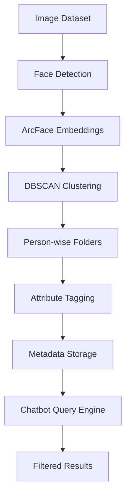

# FaceChat.ai
UCS532 — Computer Vision (GOOD-TO-GO) | RAI – 3W1C

A fully local intelligent face clustering and conversational image retrieval system built as part of the UCS532 Computer Vision course.
The system automatically groups faces using ArcFace + DBSCAN and allows users to search images using natural language queries like
"Show me Person 1 with Person 2 wearing black."

## 📌 Overview

Managing thousands of images from weddings, college events, offices, or CCTV systems is extremely challenging. Traditional tools only provide basic face grouping and lack conversational search, multi-person filtering, and attribute-based retrieval.

This project leverages computer vision and unsupervised learning techniques to automatically cluster faces and integrates a natural language chatbot interface for intelligent image search.

## 🚀 Features

- Real-time face detection and embedding extraction

- ArcFace-based 512D feature representation

- Unsupervised clustering using DBSCAN

- Automatic person-wise folder organization

- Multi-person co-occurrence detection

- Clothing & basic attribute tagging (e.g., black shirt)

- Conversational chatbot interface for search

- Fully local processing (privacy-preserving)

## 🛠 Tech Stack

| Technology            | Purpose                           |
| --------------------- | --------------------------------- |
| Python                | Core programming language         |
| OpenCV                | Image processing & face detection |
| InsightFace (ArcFace) | Face embedding extraction         |
| Scikit-learn          | DBSCAN clustering                 |
| NumPy                 | Numerical computations            |
| Pandas                | Metadata management               |
| Matplotlib            | Visualization                     |
| Custom NLP Parser     | Conversational query handling     |

## 🧩 How It Works

1. The system loads raw images from the dataset.

2. Faces are detected and cropped from each image.

3. ArcFace generates high-dimensional embeddings.

4. DBSCAN clusters embeddings into person-wise groups.

5. Metadata (clothing color, brightness) is generated.

6. The chatbot parses user queries.

7. Filtered image results are displayed instantly.

## 🏗 System Architecture

## 📊 Evaluation

- High clustering purity observed with ArcFace embeddings

- Effective multi-person retrieval performance

- Fast response time for medium-sized datasets (5k–10k images)

- Improved usability compared to traditional folder browsing

## 🔮 Future Improvements

- Integrate YOLO for advanced clothing detection

- Add emotion recognition model

- Use transformer-based NLP parsing for better query understanding

- Develop web-based UI (Flask / React)

- Scalable cloud deployment for large datasets

- Incremental clustering for live camera feeds

- Real-time video face tracking and identity persistence

- CCTV-based continuous monitoring and event logging

## 👨‍💻 Authors

| # | Name           | Roll No.   | GitHub | Blog|
|---|---------------|------------|--------|--------|
| 1 | Shiwang Garg | 102323053  | [@shiwanggarg](https://github.com/shiwanggarg) | (https://substack.com/@shiwanggarg/posts)
| 2 | Pranjal Garg | 102323055  | [@Pranjal02garg](https://github.com/Pranjal02garg) | (https://medium.com/@pranjalgarg02gp)
| 3 | Saam Gupta       | 102323056  | [@saanchi-gupta](https://github.com/saanchi-gupta) |
